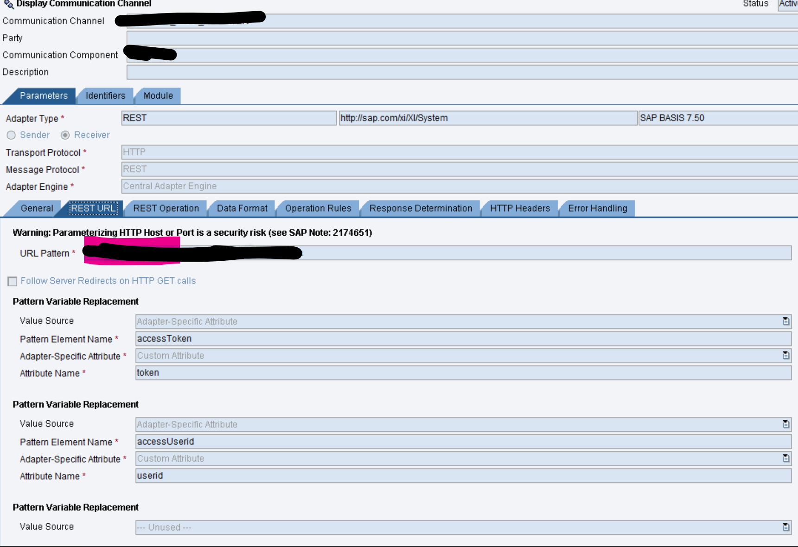
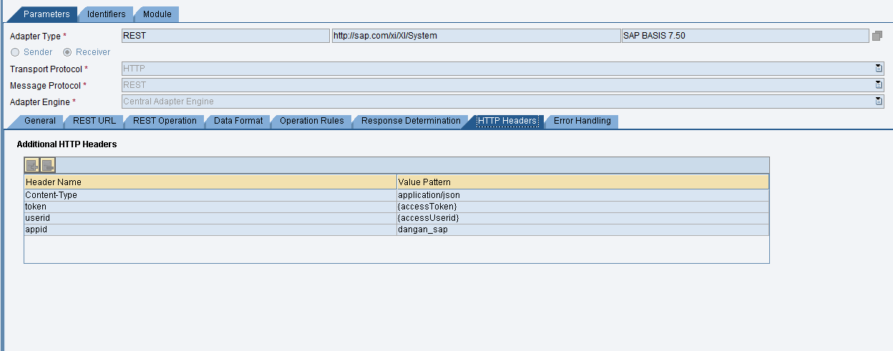
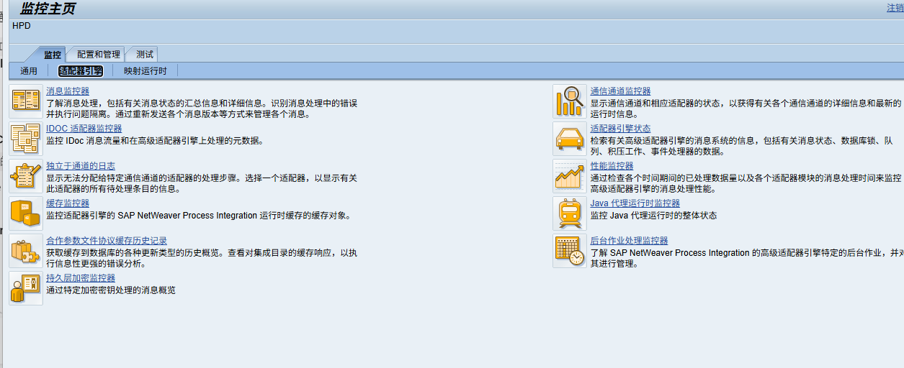

在之前的配置中，你把 Java 代码里名为 Authorization 的属性，在 REST URL 页签里映射成了变量 accessToken，然后在 HTTP Headers 页签里拼接成了 Bearer {accessToken} 发送出去。

现在我们的新代码改成了写入 token 和 userid 两个属性，并且根据你之前的 Postman 截图，对方不再需要 Bearer  前缀，而是直接要求原生的 token 和 userid 字段。

你需要按照以下步骤来更新你的 Receiver REST Channel 配置：

第一步：修改【REST URL】页签 (提取两个变量)
你需要配置两个 Pattern Variable Replacement（替换掉你原来那一个 accessToken 的配置）：

第一个变量 (提取 token)：

Value Source: Adapter-Specific Attribute

Pattern Element Name: var_token (你可以自己起名，比如这个)

Adapter-Specific Attribute: Custom Attribute

Attribute Name: token (必须和新代码里保持完全一致)

第二个变量 (提取 userid)：
(如果下方没有空行，点击左侧的 + 号添加一行)

Value Source: Adapter-Specific Attribute

Pattern Element Name: var_userid

Adapter-Specific Attribute: Custom Attribute

Attribute Name: userid (必须和新代码里保持完全一致)

第二步：修改【HTTP Headers】页签 (拼装最终的请求头)
把你原来截图里的 Authorization 那一行删掉。然后根据你之前 Postman 的要求，添加以下三行：

添加 token 头:

Header Name: token

Value Pattern: {var_token} (注意：这里没有 Bearer 前缀，直接加大括号包裹你在上一步起的名字)

添加 userid 头:

Header Name: userid

Value Pattern: {var_userid}

添加 appid 头 (固定值):

Header Name: appid

Value Pattern: dangan_sap

(保留你原来的 Content-Type: application/json 不动)

按照这样配置保存并激活后，PO 就会准确地把你通过 Java UDF 生成的 token 和 userid 塞进 HTTP Header 里发给泛微系统了。

看你的截图，你应该点击右上方第一个图标，也就是：

👉 “通信通道监控器” (带有放大镜和扳手图标那个)

点击进去之后，按照以下步骤操作：

在类似“通道(Channel)”的搜索框里，输入你的通道名字：CC_REST_FI080_RECEIVER

点击执行 (Go) 进行搜索。

在下方列表中选中搜索出来的这条通道。

点击界面上的 "Ping" 按钮即可。

(附带提醒：如果你之后从 S/4HANA 发了真实数据过来，想要看数据成功了没有、或者报了什么错，你应该点这页左上角的 “消息监控器” 去看日志。但现在为了测 Ping 通不通，去点右上角的通信通道监控器就可以了。) 祝 Ping 成功！有问题随时发截图过来。

在 SAP PO 中，“Ping 通道” 是一个非常标准的网络连通性测试功能。

要想 Ping 你刚才配置的这个接收方通道 (CC_REST_FI080_RECEIVER)，你需要离开 ID (Integration Directory) 配置界面，进入 PO 的监控平台 (NWA 或 PIMON)。

以下是具体的操作步骤：

🛠️ 步骤一：进入通信通道监控器 (Communication Channel Monitor)
登录 SAP PO 的主页（通常 URL 是 http://<你的PO服务器IP>:<端口>/dir 或者 /pimon）。

点击进入 Configuration and Monitoring Home (配置和监控主页)，或者叫 NWA (NetWeaver Administrator)。

导航到 Monitoring (监控) 页签 -> Adapter Engine (适配器引擎) -> Communication Channel Monitor (通信通道监控)。

🛠️ 步骤二：执行 Ping 操作
在通道监控界面，你会看到很多过滤条件。在 Channel (通道) 这一栏，输入你刚才的通道名称：CC_REST_FI080_RECEIVER。

点击 Go (执行) 进行搜索。

在下方的搜索结果列表中，单击选中这一条通道数据。

在选中状态下，点击页面上方（或下方详细信息标签页里）的 "Ping" 按钮。

系统会弹出一个窗口或在下方显示 Ping 的结果日志。如果显示绿色，说明网络是通的。

⚠️ 非常重要的提示 (防坑必看)
在使用 Ping 功能时，你必须了解 REST 通道 Ping 的局限性：

Ping 只能测“网络”： 当你点击 Ping 时，PO 服务器只会去尝试连接 https://eap-t.ghsmc.com 这个地址，看看域名能不能解析、服务器的 443 端口能不能连上、SSL 证书能不能握手。

Ping 不会执行代码和鉴权： Ping 不会去跑我们辛辛苦苦写的那个 Java Function Library，不会去获取 Token，也不会执行 RSA 加密。它就是一个纯粹的底层网络探测。

💡 如何进行真正的“业务连通性”测试？
如果你想测试我们写的 Token 代码和动态 Header 到底有没有生效，光靠 Ping 是不够的。你需要触发一次真实的报文转换。你有两种方式：

直接从源系统发数据（最推荐）：
让你们的发送方系统（比如 S/4HANA 里的 ABAP 程序）真实地触发一条数据过来。然后你进入 PO 的 Message Monitor (消息监控) 里，查看这条消息的运行轨迹。如果成功了，OA 就会收到数据；如果报错，你能直接点开日志（Message Log），看到究竟是哪一步（比如 Java 代码报错还是对方返回了 401 鉴权失败）出了问题。

使用 PO 自带的测试工具：
在 NWA 的监控页签下，有一个叫 Send Test Message (发送测试消息) 的工具。你可以手动选定你的 Sender 和 Receiver 接口，粘贴一段假冒的 XML 报文（按照你之前的 DT_FI180_REQ 格式），点击 Send 发送。这样也能完整触发整个转换和发送流程。

总结： 先用 Ping 测一下网络通不通（排除防火墙问题），如果网络是通的，就直接从前端推一条真实数据过来做全链路测试吧！